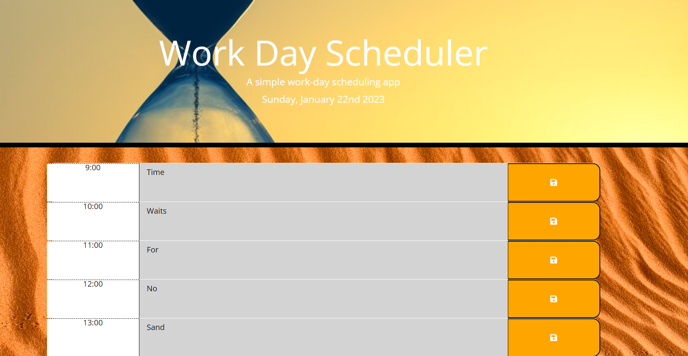

# Work Day Planning App

<br> 

### Code repository:
https://github.com/Jakinlade/Work-Day-Planning-App

### Deployed application:
https://jakinlade.github.io/Work-Day-Planning-App/

<br>
Description
This is a simple calendar app for scheduling my work day. 

This app allows the user to generate a schedule for their work day. The user can input events for each hour of the work day and save them for later viewing.

--

The original code provided a basic html and css layout for the app. However, the functionality to input and save events was not included.

In my solution, I added additional functionality to the js file, using jQuery, to create timeblocks for standard 9-5 working hours, using a for loop. 
I also added logic to change the background color of the timeblocks relative to the current time.

I also enhanced the UI by adding the current date and time at the top of the calendar and adding a save button for each timeblock. 
I added an event listener to the save button to save the events description info to local storage and to then retrieve it from local storage and display them back on the same timeblocks.

I also added further CSS styling to give the body and jumbotron background images. I Changed the text color to make it more readable.


<br>

## Website Screenshot


<br>

## Code Examples 

A simple section of code to log the current date and time in the jumbotron.

```js
$("#currentDay").text(moment().format("dddd, MMMM Do YYYY"));
```

A for loop function to create timeblocks for standard business hours, displaying the time, event descriptions and buttons to save the info input to that row. 

```js
var currentTime = moment().hour();
    
    for (var i =9; i < 18; i++) {
        // create div for each timeblock
        timeBlock = $("<div>");
        timeBlock.addClass("row time-block");

        // create div for the hour
        var hourDiv = $("<div>");
        hourDiv.addClass("hour col-md-2");
        hourDiv.text(i + ":00");
        timeBlock.append(hourDiv);

        // create a text area for the event
        var eventTxt = $("<textarea>");
        eventTxt.addClass("col-md-8 description");
        timeBlock.append(eventTxt);

        // create a save button
        var saveBtn = $("<button>");
        saveBtn.addClass("col-md-2 saveBtn");
        saveBtn.html("<i class='fas fa-save'></i>");
        timeBlock.append(saveBtn);
```

<br>

## Technologies used:

<br>


<br>


<br>


## License
MIT License

Copyright (c) 2022 Jonathan Johnson

Permission is hereby granted, free of charge, to any person obtaining a copy of this software and associated documentation files (the "Software"), to deal in the Software without restriction, including without limitation the rights to use, copy, modify, merge, publish, distribute, sublicense, and/or sell copies of the Software, and to permit persons to whom the Software is furnished to do so, subject to the following conditions:

The above copyright notice and this permission notice shall be included in all copies or substantial portions of the Software.

THE SOFTWARE IS PROVIDED "AS IS", WITHOUT WARRANTY OF ANY KIND, EXPRESS OR IMPLIED, INCLUDING BUT NOT LIMITED TO THE WARRANTIES OF MERCHANTABILITY, FITNESS FOR A PARTICULAR PURPOSE AND NONINFRINGEMENT. IN NO EVENT SHALL THE AUTHORS OR COPYRIGHT HOLDERS BE LIABLE FOR ANY CLAIM, DAMAGES OR OTHER LIABILITY, WHETHER IN AN ACTION OF CONTRACT, TORT OR OTHERWISE, ARISING FROM, OUT OF OR IN CONNECTION WITH THE SOFTWARE OR THE USE OR OTHER DEALINGS IN THE SOFTWARE.